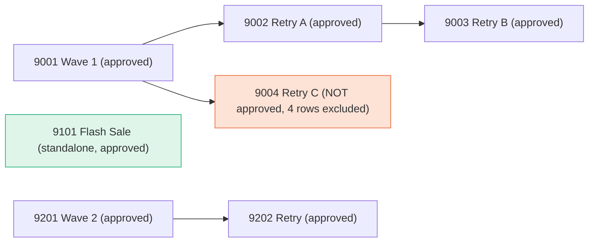

# Comm-Log Send Reconciliation
### Merchant 501 · October 2026 · Diwali campaigns

Finance says the number of qualifying sends (`target_base`) is **22**.
A simple `SELECT COUNT(*)` on the log table says **30**.
This repo explains, step by step, how 30 becomes 22, shows the queries that
*look* right but aren't, and lists what surprised me in the data.

**Short answer:** 30 rows → remove 4 rows from a campaign that was never approved
→ 26 → count each customer once inside a retry chain (−3, then −1) → **22**.

---

## Contents

1. [The problem](#1-the-problem)
2. [The data](#2-the-data)
3. [How I explored it](#3-how-i-explored-it)
4. [The bridge: 30 → 22](#4-the-bridge-30--22)
5. [The charts](#5-the-charts)
6. [The final SQL, explained](#6-the-final-sql-explained)
7. [Wrong routes I ruled out](#7-wrong-routes-i-ruled-out)
8. [What surprised me](#8-what-surprised-me)
9. [How to run](#9-how-to-run)
10. [Files in this repo](#10-files-in-this-repo)

---

## 1. The problem

A merchant (id 501) ran Diwali SMS campaigns in October 2026. Every message
attempt is one row in `communication_log`. Finance reports a metric called
`target_base` = how many customers each campaign actually reached. Finance says
it's 22. The raw table has 30 rows. The job: reproduce the 22 from the raw data
and explain every step of the gap.

## 2. The data

Two tables in `data/comm_log.db` (also as CSVs in `data/`).

**`campaign`** — one row per campaign (7 rows). The important column is
`parent_id`: if it's filled in, this campaign is a *retry* of another campaign.
Two other columns decide whether a campaign is allowed in reports:
`creation_status` must be approved (or aborted/resumed/stopped) **and**
`processing_status` must be `processed`.

**`communication_log`** — one row per message attempt (30 rows). Key columns:
`communication_id` (which campaign), `customer_id` (who), `delivery_status`
(900 = delivered, 1100 = failed), `sent_time`, `credit_used`.

Here is how the 7 campaigns relate to each other (arrow = "is a retry of"):



So there are three "families": 9001 with its retries, 9201 with its retry, and
9101 on its own. Campaign 9004 is the odd one: it was sent, but never approved.

**The two rules from the data dictionary that decide the answer:**

- A retry campaign is *the same message tried again*. So inside one family, a
  customer who needed 3 attempts still counts as **one** customer reached.
- A standalone campaign (no parent, no children) has no retries. Every send
  under it is its own event, so the same customer appearing twice counts **twice**.

## 3. How I explored it

Before writing any answer I ran a few "what's in here?" queries
(`sql/explore.sql`). Each one told me something I needed later:

| What I ran | What it told me |
|---|---|
| Count rows by merchant / type / channel / month | Everything is one merchant, one type, one channel, one month. So scope filters won't remove anything, but they should still be in the query. |
| List campaigns with parent, status and row count | 9004 is `approval_awaiting` but already `processed`, with 4 rows. That's the first adjustment. |
| Rows per campaign by delivery status | Four failed (1100) rows: C2, C3 twice, D1. Those customers were retried. |
| Customers appearing more than once | C2, C3, D1 appear across retry campaigns (collapse them). C20 appears twice in the *same* standalone campaign (don't collapse). |
| Does `scheduled_time` ever differ from `sent_time`? | No, never. |
| Total credits used | 30, while target_base is 22. Noted as a surprise. |

## 4. The bridge: 30 → 22

Each step is one runnable SQL file in `sql/bridge/`. I added one adjustment at
a time, re-ran, and kept the number.

| Step | What I did | Result | Change | Why |
|---|---|---|---|---|
| 0 | Count all rows in `communication_log` | **30** | | The naive starting point. |
| 1 | Filter to merchant 501, campaign type `'2'`, October 2026 | 30 | 0 | Nothing moves, every row is already in scope. I keep the filters anyway so the definition is written down, not assumed. |
| 2 | Keep only approved + processed campaigns | 26 | −4 | Campaign **9004** is still awaiting approval. Its 4 rows (C11–C14) exist in the log but can't be reported. |
| 3 | In family **9001 → 9002 → 9003**, count each customer once | 23 | −3 | C2 needed 2 attempts, C3 needed 3. That's 13 rows but 10 customers. |
| 4 | Same for family **9201 → 9202**; leave standalone **9101** alone | **22** | −1 | D1 failed on 9201, delivered on 9202: 6 rows, 5 customers. 9101 has no retries, so all 7 sends count, including C20 twice. |
| final | | **22** | | 10 + 7 + 5 |

**Why this order?** Step 2 must come before steps 3–4. Campaign 9004 is a child
of 9001. If you collapse the family first and remove 9004 later, its 4 customers
have already been mixed into 9001's count and you get 26, not 22.

## 5. The charts

Both images are generated from the same SQL files (`make_charts.py`), so they
can't disagree with the tables.

**Chart 1 — the bridge as a waterfall.** Blue bars are totals (start and end).
Orange bars are the rows removed at each step. Read it left to right: 30, nothing
removed by scope, −4 for the unapproved campaign, −3 and −1 for the two retry
families, ending at 22.


**Chart 2 — where the 22 comes from.** One row per campaign family. Grey is raw
rows in the log, green is what actually counts. The gap between grey and green is
the retry collapse. Notice 9101: grey and green are both 7 because it's
standalone, nothing gets collapsed there.


| Family | Name | Has retries? | Rows in log | Distinct customers | Counted |
|---|---|---|---|---|---|
| 9001 | Diwali Cart Recovery – Wave 1 | yes | 13 | 10 | **10** |
| 9101 | Diwali Flash Sale – Standalone | no | 7 | 6 | **7** |
| 9201 | Diwali Wave 2 | yes | 6 | 5 | **5** |
| | | | | | **22** |

The middle row is the one to notice: 9101 has 6 distinct customers but counts as
7, because C20 was sent twice and it's a standalone campaign.

## 6. The final SQL, explained

File: `sql/bridge/04_final.sql`. Runs directly against `data/comm_log.db`.
It has four parts.

```sql
-- PART A: find the "root" (original) campaign of every campaign.
-- A campaign with no parent is its own root.
-- A retry gets the same root as its parent, however deep the chain goes.
WITH RECURSIVE chain(id, root_id) AS (
    SELECT id, id FROM campaign WHERE parent_id IS NULL
    UNION ALL
    SELECT c.id, ch.root_id
    FROM campaign c
    JOIN chain ch ON c.parent_id = ch.id
),

-- PART B: keep only log rows that are in scope AND on approved campaigns.
eligible AS (
    SELECT l.*, ch.root_id
    FROM communication_log l
    JOIN campaign c  ON c.id  = l.communication_id
    JOIN chain    ch ON ch.id = c.id
    WHERE l.merchant_id = 501
      AND l.communication_type = '2'
      AND l.sent_time >= '2026-10-01'
      AND l.sent_time <  '2026-11-01'
      AND c.creation_status IN ('approved', 'aborted', 'resumed', 'stopped')
      AND c.processing_status = 'processed'
),

-- PART C: count per root campaign.
--   root has retries   -> count each customer once
--   root is standalone -> count every send
per_root AS (
    SELECT
        e.root_id,
        CASE
            WHEN EXISTS (SELECT 1 FROM campaign x WHERE x.parent_id = e.root_id)
                THEN COUNT(DISTINCT e.customer_id)
            ELSE COUNT(*)
        END AS qualifying_sends
    FROM eligible e
    GROUP BY e.root_id
)

-- PART D: add up the three families.
SELECT SUM(qualifying_sends) AS target_base
FROM per_root;
```

**Part A in plain words.** The `campaign` table only tells you each campaign's
*direct* parent. To collapse a whole family I need each campaign's *original*
campaign. The recursive part starts with the campaigns that have no parent
(they are their own root), then attaches their children to the same root, then
the children's children, and so on until there are no more. This works for any
chain length. `04_final_breakdown.sql` is the same query with the last `SUM`
removed, so you see one row per family (that's where the 10 / 7 / 5 table
above comes from).

**Three choices I'd defend:**

- *Recursive query instead of a simple parent–child join.* The data dictionary
  says chains can be deeper than two levels, and 9001 already has two children.
  A plain join handles one level and would silently miss deeper chains.
  `tests/` includes a 4-level chain to prove the recursive version works.
- *Filter first, then collapse.* Explained under the bridge: doing it the other
  way gives 26.
- *`delivery_status` is not in the query.* The metric is about customers a
  campaign *targeted*, not how many messages got delivered. Adding a delivered
  filter happens to give 22 here, but for the wrong reason (next section).

## 7. Wrong routes I ruled out

Each of these is a runnable file in `sql/traps/` with a comment explaining why
it's wrong.

| # | What it does | Gives | Why it's wrong |
|---|---|---|---|
| T1 | Count only delivered rows (`delivery_status = 900`) | 26 | Counts delivery outcomes, not communications. |
| **T2** | **Delivered rows on approved campaigns** | **22** | **Right number, wrong reason.** It only matches because every failed message in this data got exactly one successful retry. Add one customer who fails twice and is never delivered, and it breaks (the test shows it giving 24 when the answer is 25). It has no retry logic at all. |
| T3 | Count distinct (campaign, customer) pairs | 25 | Counts C2 twice (under 9001 and 9002) and C20 once. Two mistakes in opposite directions. |
| T4 | Collapse families *before* removing unapproved campaigns | 26 | 9004's customers get mixed into 9001. |
| T5 | Count distinct customers overall | 25 | Ignores that a customer can be in two different families, and that standalone re-sends count separately. |

T2 is the dangerous one. It's the first query most people would write, it
matches Finance this month, and it will quietly be wrong next month. The tests
in `tests/test_reconciliation.py` exist mainly to prove this: on a small
modified copy of the data, T2 returns 24 while the real query returns the
hand-calculated 25.

## 8. What surprised me

**The wrong query gives the right answer.** Counting delivered rows on
approved campaigns gives exactly 22 with no retry logic. That's worse than an
obvious mismatch, because it passes a quick check and nobody looks further.

**Messages went out before approval.** Campaign 9004 is `processed` but
still `approval_awaiting`. Four real SMS were sent and four credits used on a
campaign the report doesn't count. If it's approved later, October's number
might change from 22 to 26.

**Retries branch.** The data dictionary describes a straight chain (A → B → C),
but 9001 has two children. That's exactly the case a simple two-level join
gets wrong.

**Same customer, same campaign, 10 days apart.** C20 was sent under 9101 on
Oct 10 and again on Oct 20. Nothing in the row says whether that was on
purpose. The only reason to count it twice is that 9101 has no retry chain. A
lot rides on `parent_id`.

**Billing and reporting don't match.** Credits used = 30, target_base = 22.
Every attempt costs a credit, whether or not it counts. That 8-credit gap is a
finance question, not just a data one.

**A case the data never tests.** No customer here fails on *every* attempt. If
one did, "customers reached" and "customers targeted" would give different
answers. I've gone with *targeted* (the query counts them) and flagged it,
rather than quietly picking whichever reading gave 22.

**Everything is uniform.** One merchant, one channel, one month,
`scheduled_time` always equals `sent_time`. Convenient, but it means the data
can't tell you if the scope filters even work, which is why they're in the SQL
and the tests, not just described here.

## 9. How to run

Only standard Python is needed (`sqlite3` is built in).

```
python run_bridge.py                 # prints the bridge, the per-family breakdown and the wrong routes; checks the answer is 22
python tests/test_reconciliation.py  # runs 5 checks and prints PASS for each
```

`make_charts.py` is optional: it only regenerates the two images in `docs/`
and needs `pip install matplotlib`.

To run any single SQL file yourself:

```
sqlite3 data/comm_log.db < sql/bridge/04_final.sql
```

## 10. Files in this repo

```
data/                          the database and CSVs, exactly as provided
sql/explore.sql                the queries I ran first, to understand the data
sql/bridge/00_naive.sql        step 0  -> 30
sql/bridge/01_scope.sql        step 1  -> 30
sql/bridge/02_eligible_campaigns.sql   step 2 -> 26
sql/bridge/03_collapse_family_a.sql    step 3 -> 23
sql/bridge/04_final.sql        step 4  -> 22   (THE ANSWER)
sql/bridge/04_final_breakdown.sql      same logic, one row per family
sql/traps/T1..T5_*.sql         the wrong routes, each with a comment
run_bridge.py                  runs every step and prints the tables
tests/test_reconciliation.py   5 checks: real-data numbers + a tricky dataset where T2 breaks
make_charts.py                 regenerates docs/bridge.png and docs/breakdown.png
docs/                          the two charts
```

**How I worked, in one paragraph.** Exploration first, to see the campaign
tree, the status mix and the repeated customers. Then the naive count, then one
adjustment at a time, keeping every intermediate number. When I noticed the
delivered-rows shortcut also gave 22, I built a small tricky dataset to check
which query was right for the right reasons before trusting mine. I used AI
tools to help draft SQL and this write-up; the order of investigation, the
decisions about what to check next, the trap analysis and the test cases are my
own calls, and I can walk through every line.
