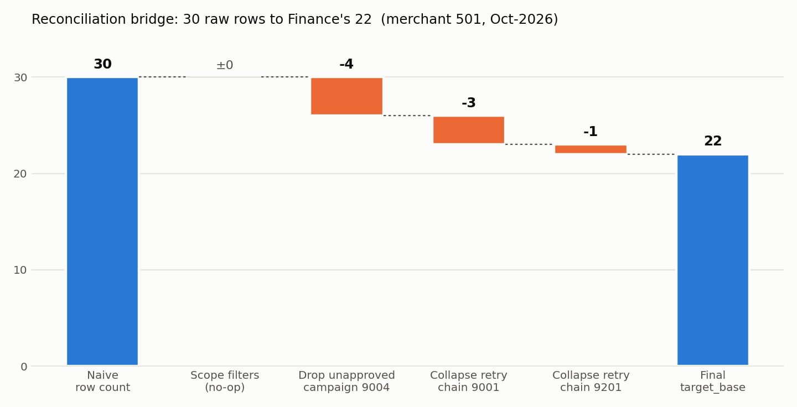
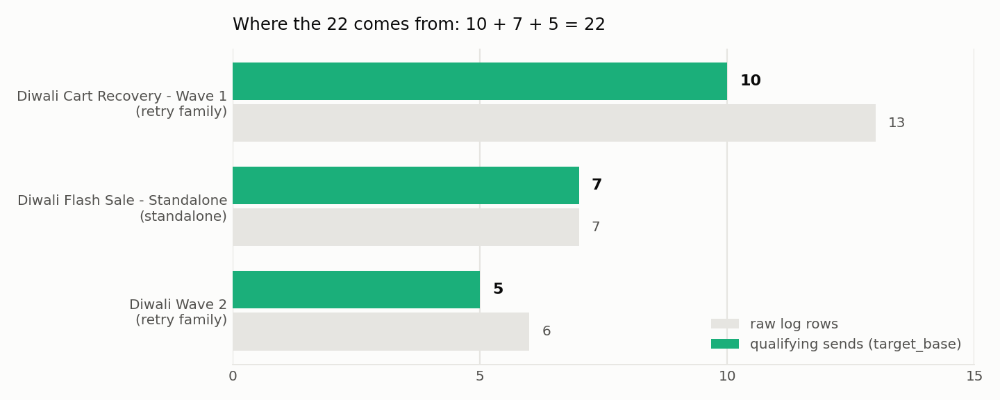

# Comm-Log Send Reconciliation — merchant 501, October 2026

Finance reports `target_base = 22` for merchant 501's Diwali campaigns. A naive
`SELECT COUNT(*) FROM communication_log` says 30. This repo reproduces the 22
from the raw data and shows every adjustment in between — including the routes
that looked right and weren't.

**TL;DR** — 30 raw rows → drop 4 rows from a campaign that never cleared approval
(26) → collapse two retry chains so a customer who needed several attempts counts
once (−3, −1) → **22**. The standalone campaign is deliberately *not* deduplicated.

```
python run_bridge.py                 # bridge, per-root breakdown, wrong routes
python tests/test_reconciliation.py  # or: python -m pytest -q
```

Stdlib only (`sqlite3`). Every number below is produced by a file in `sql/`,
nothing is hard-coded. (`make_charts.py` needs matplotlib and only regenerates
the two PNGs in `docs/`.)



---

## 1. Reconciliation bridge

| Step | Description | Result | Δ | Reason |
|---|---|---|---|---|
| 0 | Naive count of `communication_log` rows | **30** | | starting point |
| 1 | Apply reporting scope: `merchant_id = 501`, `communication_type = '2'`, `sent_time` in Oct-2026 | 30 | 0 | No rows move — the whole file is already in scope. Kept in the SQL anyway so the definition is encoded, not assumed. |
| 2 | Keep only campaigns that cleared the reporting gate: `creation_status IN ('approved','aborted','resumed','stopped') AND processing_status = 'processed'` | 26 | −4 | Campaign **9004** ("Retry C (pending)") is `approval_awaiting` but already `processed`. Its 4 log rows (C11–C14) exist because the send pipeline ran ahead of approval; they are not reportable. |
| 3 | Collapse retry family **9001 → {9002 → 9003}** to distinct customers | 23 | −3 | A retry is the *same* underlying communication. C2 took 2 attempts, C3 took 3; 13 rows → 10 customers. Chain walked with a recursive CTE because 9001 has two children (a tree, not a line). |
| 4 | Collapse retry family **9201 → 9202** the same way; leave standalone **9101** at row level | **22** | −1 | D1 failed on 9201, delivered on 9202: 6 rows → 5 customers. 9101 has no parent and no children, so each of its 7 sends is its own event — C20's two sends (Oct 10 and Oct 20) both count. |
| final | | **22** | | 10 (family 9001) + 7 (standalone 9101) + 5 (family 9201) |

Per-root view (`sql/bridge/04_final_breakdown.sql`):



| root | name | has retries? | raw rows | distinct customers | qualifying sends |
|---|---|---|---|---|---|
| 9001 | Diwali Cart Recovery – Wave 1 | yes | 13 | 10 | **10** |
| 9101 | Diwali Flash Sale – Standalone | no | 7 | 6 | **7** |
| 9201 | Diwali Wave 2 | yes | 6 | 5 | **5** |
| | | | | | **22** |

---

## 2. Final SQL (`sql/bridge/04_final.sql`)

Runnable as-is against `data/comm_log.db`:

```sql
WITH RECURSIVE chain(id, root_id) AS (
    SELECT id, id FROM campaign WHERE parent_id IS NULL
    UNION ALL
    SELECT c.id, ch.root_id
    FROM campaign c
    JOIN chain ch ON c.parent_id = ch.id
),
eligible AS (
    SELECT l.*, ch.root_id
    FROM communication_log l
    JOIN campaign c  ON c.id  = l.communication_id
    JOIN chain    ch ON ch.id = c.id
    WHERE l.merchant_id = 501
      AND l.communication_type = '2'
      AND l.sent_time >= '2026-10-01'
      AND l.sent_time <  '2026-11-01'
      AND c.creation_status IN ('approved', 'aborted', 'resumed', 'stopped')
      AND c.processing_status = 'processed'
),
per_root AS (
    SELECT
        e.root_id,
        CASE
            WHEN EXISTS (SELECT 1 FROM campaign x WHERE x.parent_id = e.root_id)
                THEN COUNT(DISTINCT e.customer_id)   -- retry family: each customer once
            ELSE COUNT(*)                            -- standalone: every send is an event
        END AS qualifying_sends
    FROM eligible e
    GROUP BY e.root_id
)
SELECT SUM(qualifying_sends) AS target_base
FROM per_root;
```

Design choices worth defending:

- **Recursive CTE, not a self-join.** The README says chains can be deeper than two levels, and 9001 already branches (9002 and 9004 are both its children). A fixed `parent → child` join would silently under-collapse a 3-level chain; the CTE handles any depth and any branching. `tests/test_deeper_chain_is_handled` proves it on a 4-level chain.
- **Eligibility before collapse.** 9004 is a child of 9001. If you collapse first and filter later, C11–C14 get absorbed into family 9001's distinct-customer count and the answer is 26 (`sql/traps/T4`). Filter at the campaign level, then collapse what remains.
- **`delivery_status` is not in the query.** The metric is about customers targeted per underlying communication, not about delivery outcome. See the trap below for why leaving it out matters.
- **"Standalone" is decided structurally** (no parent, no children), not by name.

---

## 3. What I tried that was wrong (`sql/traps/`)

| # | Route | Result | Why it's wrong |
|---|---|---|---|
| T1 | Count rows with `delivery_status = 900` | 26 | Counts outcomes, not communications. |
| **T2** | **Delivered rows on eligible campaigns** | **22** | **Lands on the right number by coincidence** — in this dataset every failed attempt is followed by exactly one delivered retry, so "# of 900 rows" happens to equal "distinct customers per chain". Add one customer who fails twice and is never redelivered, or one who is delivered twice inside a chain, and it drifts. `tests/test_trap_t2_breaks_on_adversarial_data` shows it returning 24 where the correct answer is 25. A bridge built on this route has no retry-chain step in it at all. |
| T3 | `DISTINCT (communication_id, customer_id)` on eligible rows | 25 | Over-counts retries (C2 appears under 9001 and 9002) and under-counts the standalone (C20's two sends → 1). Two errors in opposite directions. |
| T4 | Collapse chains *before* the eligibility filter | 26 | 9004's customers leak into family 9001. |
| T5 | `COUNT(DISTINCT customer_id)` overall | 25 | Ignores that different underlying communications can reach the same customer, and that standalone re-sends count separately. |

T2 is the one I'd flag to anyone reviewing this metric in production: it's the
query most people would write, it passes a spot-check against Finance's number
this month, and it will be wrong next month.

---

## 4. Things in the data that surprised me

- **The wrong query gives the right answer.** `delivery_status = 900` + eligibility returns exactly 22. That coincidence is more dangerous than an obvious mismatch, because it survives a sanity check.
- **The send pipeline runs ahead of approval.** 9004 is `processing_status = 'processed'` while still `approval_awaiting` — 4 real SMS went out (and 4 credits were spent) on a campaign that reporting says doesn't exist yet. Depending on how approval resolves, October's 22 could later become 26 (approved) or stay 22 with 4 credits to explain.
- **Retries are a tree, not a chain.** 9001 has two children (9002 and 9004). The README describes A → B → C; the data has branching, which is exactly the case a hand-written two-level join gets wrong.
- **The same customer, 10 days apart, in one campaign.** C20 is sent under 9101 on Oct 10 and again on Oct 20. Nothing in the row distinguishes "legitimate re-target" from "accidental double send" — only the campaign's structural position (no retry chain) tells you to count it twice. That's a lot of weight on `parent_id`.
- **Billing and reporting disagree by design.** `SUM(credit_used)` = 30, `target_base` = 22. Every attempt costs a credit whether or not it counts as a qualifying send, so the 8-row gap is a finance question in its own right, not just a data-cleaning one.
- **A definitional gap the data never exercises.** No customer in this dataset fails on *every* attempt in a chain. If one did, "distinct customers reached" and "distinct customers targeted" would diverge. I've read the README's definition as *targeted* (the query counts them) and flagged it, rather than silently picking whichever reading made the number work.
- **`scheduled_time == sent_time` on every row, and every scope filter is a no-op** (one merchant, one type, one channel, one month). Convenient, but it means the dataset can't tell you whether the scope filters are even wired correctly — which is why they're in the SQL and the adversarial tests, not just in the README.

---

## 5. Repo layout

```
data/                         comm_log.db + the CSV equivalents (as provided)
sql/bridge/00..04_*.sql       one runnable file per bridge step; 04_final.sql is the answer
sql/bridge/04_final_breakdown.sql   per-root view of the 22
sql/traps/T1..T5_*.sql        the wrong routes, each with a comment on why
sql/explore.sql               the exploration queries I ran first
run_bridge.py                 executes every step, prints the bridge, asserts 22
make_charts.py                regenerates docs/bridge.png and docs/breakdown.png from the SQL
tests/test_reconciliation.py  real-data checks + adversarial fixture where the shortcut fails
```

## 6. How I worked

Exploration first (`sql/explore.sql`): scope, campaign tree, status mix, repeated
customers. The repeated-customer query is what surfaced both the retry chains and
C20, and the campaign-tree query is what surfaced 9004. I wrote the naive query,
then added one adjustment at a time and re-ran, keeping the intermediate numbers.
When T2 also produced 22 I built a fixture to break it before trusting my own
query over it. AI tooling was used for drafting SQL and this write-up; the
investigation order, the trap analysis, and the adversarial cases are the parts
I'd expect to be asked about, and I can walk through every line.
